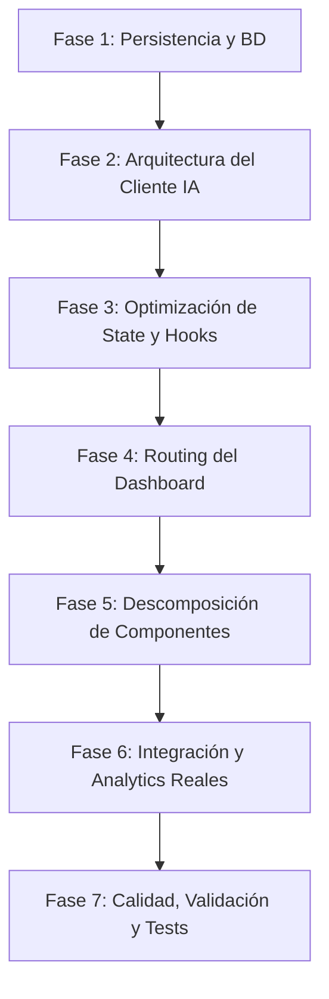

# 📋 Plan de Implementación Maestro — UGC Avatar System

**Ecosistema:** ugc-avatar-system | **Versión:** 2.0  
**Fecha:** 16 de junio de 2026  
**Estatus:** Plan Maestro para Ejecución por IA (Propia o Terceros)

---

## 🚫 CLAUSULAS DE ESTRICTO CUMPLIMIENTO (SLA DE EJECUCIÓN)

Cualquier sistema de IA o desarrollador que asuma la ejecución de este plan **DEBE** adherirse estrictamente a las siguientes directrices sin excepción alguna. El incumplimiento de cualquiera de estas cláusulas invalidará la ejecución del plan:

1. **PROHIBIDO OMITIR PASOS:** Cada fase y cada paso dentro de las fases deben completarse de manera secuencial. No se permite saltarse pasos ni dar por hecho tareas sin haber escrito e integrado el código correspondiente.
2. **PROHIBIDO MODIFICAR EL ALCANCE:** El ejecutor no puede decidir de forma unilateral ignorar una recomendación o refactorización detallada en este documento. Si un paso indica "separar en 7 componentes", se deben crear los 7 componentes, no menos.
3. **CONSERVACIÓN DE LA ESTRUCTURA MULTI-AVATAR:** El sistema debe permanecer completamente dinámico y escalable para múltiples avatares. Está estrictamente prohibido hardcodear datos, configuraciones, prompts específicos de Milena Reyes o heurísticas de género dentro de archivos lógicos del sistema (ej. `utils.ts`, `deepseek.ts`). Todo debe ser parametrizado.
4. **INTEGRIDAD DE TIPOS (TYPESCRIPT):** No se permite el uso del tipo `any` en los nuevos archivos ni en los refactorizados. Todo el código debe estar tipado de manera estricta y compilar sin warnings (`strict: true`).
5. **VERIFICACIÓN DEL BUILD:** Tras completar cada paso individual, se debe ejecutar `npm run build` y `npm run lint`. Cualquier error de compilación o de tipado debe solucionarse antes de proceder al siguiente paso.
6. **MANTENIMIENTO DEL RENDIMIENTO:** Cada refactorización de componente debe asegurar que no se introduzcan re-renders innecesarios. Se deben emplear `useMemo`, `useCallback` y `React.memo` donde sea apropiado según el plan.

---

## 🗺️ Fases del Plan de Implementación

---

## 📑 DETALLE DE LAS FASES DE IMPLEMENTACIÓN

---

### 🗄️ Fase 1: Persistencia y Base de Datos Real (Prioridad: Crítica)

El objetivo de esta fase es eliminar por completo la dependencia del `localStorage` como base de datos principal y asegurar la persistencia del estado en el lado del servidor.

#### 1.1 Configurar Prisma y la Base de Datos
- Inicializar Prisma en el proyecto con el comando: `npx prisma init`.
- Definir la conexión a una base de datos PostgreSQL (local o vía Supabase).
- Crear las siguientes tablas/modelos en `schema.prisma`:
  - `Avatar`: Almacena la identidad base (id, name, age, niche, location, backstory, characterDna, toneOfVoice, audioLanguage, promptStyle, etc.).
  - `PostIdea`: Almacena ideas de contenido vinculadas a un `Avatar` (id, avatarId, title, type, scenePrompt, formattedFlowPrompt, instagramCaption, status [draft/generated/published], productInfo [json], etc.).
  - `ChatSimulation`: Almacena sesiones de chat vinculadas a un `Avatar` (id, avatarId, leadName, leadBio, funnelStatus [active/converted/lost], notes, createdAt).
  - `ChatMessage`: Mensajes individuales vinculados a una `ChatSimulation` (id, simulationId, sender [user/avatar], text, timestamp).
  - `ShowcaseItem`: Elementos de portafolio/publicidad generados.

#### 1.2 Migrar Endpoints a CRUD Real
- Actualizar o crear las API Routes para comunicarse con Prisma en vez de en memoria o localStorage:
  - `GET /api/avatar` y `POST /api/avatar` (Creación y listado de base de datos).
  - `PUT /api/avatar/[id]` y `DELETE /api/avatar/[id]`.
  - `GET /api/ideas?avatarId=...` y `POST /api/ideas`.
  - `PUT /api/ideas/[id]` y `DELETE /api/ideas/[id]`.
  - `GET /api/chat?avatarId=...` y `POST /api/chat/message`.
  - `PUT /api/chat/[simulationId]` y `DELETE /api/chat/[simulationId]`.

#### 1.3 Eliminar Lectura/Escritura Masiva de Base64 en el Cliente
- Configurar un servicio de almacenamiento (ej. Supabase Storage o almacenamiento local en el servidor bajo `/public/uploads/`) para fotos de perfil y fotos de productos.
- Los inputs de fotos en `useAvatars` y `usePostIdeas` deben subir el archivo real al servidor y guardar únicamente la URL de la imagen en la base de datos, eliminando el guardado de strings base64 en `localStorage`.

---

### 🧠 Fase 2: Arquitectura del Cliente IA (`deepseek.ts`) (Prioridad: Crítica)

Esta fase corrige la duplicación de código, los bugs de timeout y organiza la base de prompts masivos.

#### 2.1 Desacoplar Prompts del Archivo de Lógica
- Crear un directorio `src/lib/prompts/`.
- Extraer todos los strings de prompts gigantes a archivos separados:
  - `src/lib/prompts/avatar-dna.ts`: Prompt maestro e inmutable de Milena Reyes.
  - `src/lib/prompts/caption-generation.ts`: Plantillas de copy de Instagram.
  - `src/lib/prompts/ideas-generation.ts`: Generador de ideas de posts.
  - `src/lib/prompts/prompt-flow.ts`: Templates para Flow (imágenes/video).
  - `src/lib/prompts/chat-personality.ts`: Reglas de interacción de DMs.
  - `src/lib/prompts/account-setup.ts`: Configuración SEO e ideas de usernames.
- Importar estos módulos en `deepseek.ts`.

#### 2.2 Corregir Bug de AbortController y Timeout
- En `callDeepSeek()` (`src/lib/deepseek.ts`), reubicar la declaración de `new AbortController()` para que ocurra **dentro** del loop de intentos (retries).
- Asegurar que cada intento limpie su propio timeout con `clearTimeout()` al finalizar de manera exitosa o fallida.

#### 2.3 Refactorizar `generateChatResponse` para que reuse `callDeepSeek`
- Eliminar la llamada `fetch` duplicada dentro de `generateChatResponse()`.
- Adaptar la función para que pase los parámetros necesarios e invoque al helper centralizado `callDeepSeek(messages, apiKey)`.
- Extraer funciones repetidas de sanitización de JSON a helpers reutilizables en `src/lib/utils.ts`.

---

### 🔄 Fase 3: Optimización de Estado y Hooks (Prioridad: Alta)

Corrige los anti-patrones de React, sincronización de estados manuales duplicados y recreación constante de funciones.

#### 3.1 Eliminar Estados Duplicados en `useAvatars` y `usePostIdeas`
- Refactorizar `useAvatars.ts`:
  - Eliminar el estado `currentAvatar`.
  - Crear un `useMemo` llamado `currentAvatar` que derive de `avatars.find(a => a.id === selectedAvatarId)`.
  - Eliminar todas las llamadas dobles `setAvatars` y `setCurrentAvatar`.
- Refactorizar `usePostIdeas.ts`:
  - Eliminar el estado `selectedIdea`.
  - Crear un `useMemo` llamado `selectedIdea` que derive del ID seleccionado y el array `postIdeas`.
  - Modificar todos los handlers de actualización para que modifiquen el item correspondiente en el array `postIdeas` en lugar de sincronizar dos estados.

#### 3.2 Limpiar Dependencias de `useCallback`
- En todos los custom hooks (`useAvatars`, `usePostIdeas`, `useChatSimulation`), revisar las dependencias del `useCallback`.
- Cambiar dependencias que usan el objeto completo del avatar (`currentAvatar`) por el ID del mismo (`currentAvatar?.id`) para evitar la recreación de funciones en cambios cosméticos.
- Resolver el stale closure en `useChatSimulation.handleSendMessage` asegurando que use la función updater de `setSimulations(prev => ...)` para leer el estado más reciente de manera segura.

---

### 🗺️ Fase 4: Routing del Dashboard (Prioridad: Alta)

Esta fase transforma la aplicación single-page en un sistema estructurado y amigable con el historial de navegación.

#### 4.1 Reorganizar Estructura de Páginas de Next.js
- Crear la ruta `/dashboard` con las sub-rutas correspondientes en la carpeta `src/app/dashboard/`:
  - `/dashboard/identity/page.tsx`
  - `/dashboard/setup/page.tsx`
  - `/dashboard/planner/page.tsx`
  - `/dashboard/chat/page.tsx`
  - `/dashboard/metrics/page.tsx`
  - `/dashboard/showcase/page.tsx`
- Migrar el layout principal y el sidebar del dashboard a `src/app/dashboard/layout.tsx`.
- Reemplazar el menú de navegación basado en pestañas por componentes `Link` de Next.js que naveguen a las sub-rutas reales.

---

### 🧩 Fase 5: Descomposición de Componentes Monolíticos (Prioridad: Alta)

Reducir la complejidad de los archivos visuales gigantes para mejorar la mantenibilidad y modularidad.

#### 5.1 Descomponer `PlannerTab.tsx` en 7 Sub-componentes
- Crear la carpeta `src/components/dashboard/planner/`.
- Extraer las siguientes secciones lógicas a archivos independientes:
  1. `IdeaList.tsx`: Lista lateral con filtros de ideas (carrusel, video, etc.).
  2. `IdeaEditor.tsx`: Panel principal de edición cuando se selecciona una idea.
  3. `PromptStyleSelector.tsx`: Control toggle interactivo entre UGC y Editorial.
  4. `ProductIntegration.tsx`: Módulo de carga de foto de producto y especificación del nombre.
  5. `AudioLanguageSelector.tsx`: Selector desplegable de idioma de audio específico para video.
  6. `PromptStepCard.tsx`: Tarjeta interactiva para mostrar una toma individual generada con su botón de copia y badges correspondientes.
  7. `CaptionOutput.tsx`: Textarea readonly con el copy de Instagram optimizado y botón para copiar.

#### 5.2 Descomponer Componentes Secundarios
- Descomponer `ChatTab.tsx` en: `ChatSidebar.tsx` (lista de simulaciones/leads), `ChatMessageBubble.tsx` (burbuja de mensaje), y `LeadContextCard.tsx` (panel derecho de contexto de ventas).
- Descomponer `IdentityTab.tsx` en: `BioForm.tsx` (formulario editable de datos base) y `TechnicalDnaCard.tsx` (caja de prompts maestros y configuraciones de voz/video).
- Reemplazar toda la duplicación de inputs y textareas estilizados por un componente reutilizable `FormField.tsx` o `Input.tsx` en `src/components/ui/`.

---

### 🔗 Fase 6: Integración y Analytics Reales (Prioridad: Media)

Migrar de demostraciones visuales y estáticas a workflows funcionales con APIs reales.

#### 6.1 Integrar la Landing Page y el Panel Administrativo a Next.js
- Mover `landing-page.html` a la ruta raíz `/src/app/page.tsx` (re-escribiendo el código en JSX/React utilizando el mismo diseño tecnológico premium).
- Mover `admin-panel.html` a la ruta `/src/app/admin/page.tsx` utilizando componentes de React y enlazándolo con los datos del servidor para gestionar MRR y clientes reales.

#### 6.2 Implementar Instagram Graph API en Metrics
- Actualizar `src/app/api/metrics/route.ts` para que se conecte mediante OAuth a Meta Business Manager / Instagram Graph API.
- Obtener datos reales de followers, impressions, reach, profile views, y engagement rate en lugar de los números mock hashes actuales.
- Utilizar una librería de visualización en el cliente (como `Recharts`) en `MetricsTab.tsx` para renderizar gráficos de líneas e históricos reales.

---

### 🧪 Fase 7: Calidad, Validación y Tests (Prioridad: Media)

Garantizar la estabilidad y robustez de la aplicación ante cambios futuros.

#### 7.1 Validación con Zod
- Agregar schemas de validación con `zod` en todas las API routes (`/api/caption`, `/api/ideas`, `/api/chat`, etc.) para verificar la estructura de entrada de los payloads antes de ser procesados por DeepSeek.
- Integrar `react-hook-form` y `@hookform/resolvers/zod` en `CreateAvatarModal` y formularios editables de identidad para validaciones en tiempo real en el cliente.

#### 7.2 Configurar Vitest y Testing Library
- Instalar y configurar Vitest en el proyecto para pruebas unitarias.
- Escribir tests para:
  - Custom hooks (`useAvatars`, `usePostIdeas`).
  - Utilidades en `src/lib/utils.ts` (especialmente `parsePromptSteps` con múltiples formatos de entrada).
  - Lógica de reintentos y timeouts en `src/lib/deepseek.ts`.

#### 7.3 Configurar Playwright
- Instalar y configurar Playwright para pruebas de integración End-to-End.
- Escribir pruebas para el flujo crítico de producción: `Crear Avatar → Generar Idea → Generar Prompt Flow → Generar Caption`.

---

## 📈 Plan de Verificación y Criterios de Aceptación

Para dar por concluida la ejecución de este plan, se deben cumplir los siguientes criterios de aceptación:

1. **Compilación Limpia:** Ejecutar `npm run build` no debe arrojar ningún error de TypeScript, Next.js ni ESLint.
2. **Persistencia Sostenida:** Al recargar el navegador en modo incógnito, toda la información de avatares creados, ideas generadas y conversaciones de chat debe persistir correctamente (ya que proviene de la base de datos).
3. **Optimización de Bundle:** El tamaño de la página raíz `/dashboard` debe reducirse de forma drástica gracias al code splitting y lazy loading de componentes.
4. **Cero Exposición de API Key:** El cliente no debe tener acceso a la clave secreta de DeepSeek a través de localStorage ni payloads de red visibles en la pestaña Network (DevTools).
